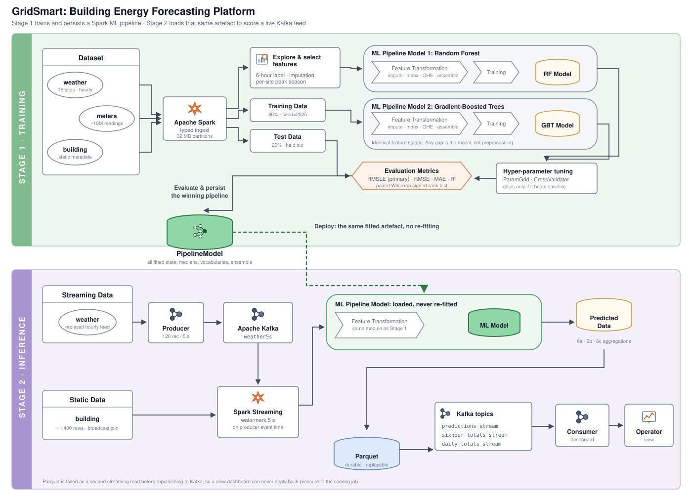
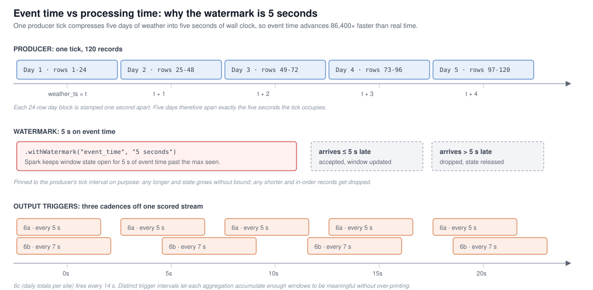

# GridSmart

[](https://github.com/mowlya-m/gridsmart-energy-streaming/actions/workflows/ci.yml)


**Real-time building energy forecasting for smart-grid operators.**
Spark MLlib trains a gradient-boosted pipeline on ~19M historical meter
readings; Kafka and Spark Structured Streaming then score a live weather feed
against that same fitted pipeline and publish per-building and per-site
forecasts to an operator dashboard.

<p align="center">
  
</p>

---

## The problem

A grid operator has to decide, ahead of time, how much generation to bring
online. Too little and load gets shed. Too much and fuel is burned for
nothing. Both errors are expensive, and the second is getting more expensive
as more of the supply mix becomes weather-dependent renewables that cannot be
dispatched on demand.

Smart meters make the problem tractable: they report consumption continuously
across an entire building estate. GridSmart turns that telemetry into a
forecast the operator can plan against: total energy draw per building, per
six-hour dispatch window, updated as weather observations arrive.

The dataset covers **16 sites spanning several countries and both
hemispheres**, which turns out to shape most of the interesting design
decisions below.

---

## What it does

| Stage | What happens | Where |
|---|---|---|
| **Ingest** | Three CSVs read under explicit schemas, no inference | `notebooks/01_*`, `gridsmart/schemas.py` |
| **Transform** | Hourly readings aggregated to 6-hour blocks; weather gaps imputed; per-site peak season derived | `gridsmart/features.py` |
| **Train** | Random Forest and GBT through identical pipelines, compared on RMSLE with a paired significance test | `notebooks/01_*`, `gridsmart/pipelines.py` |
| **Tune** | Bounded grid search on the winner, optimising RMSLE directly | `notebooks/01_*` |
| **Produce** | Plain-Python Kafka producer replaying weather at 120 records / 5 s | `gridsmart/producer.py` |
| **Score** | Structured Streaming loads the *same* fitted pipeline and predicts on the stream | `gridsmart/streaming.py` |
| **Serve** | Three aggregations → Parquet → Kafka → live dashboard | `notebooks/04_*` |

---

## Design decisions worth reading

The eight [ADRs](docs/adr/) record the reasoning behind the non-obvious
choices. Four that mattered most:

### RMSLE rather than RMSE, implemented as a real `Evaluator`

Consumption in this dataset spans several orders of magnitude; a retail unit
and a university campus sit in the same column. RMSE is dominated by the
largest buildings, so a model can score well while being badly wrong across
most of the estate. Early runs did exactly that.

Spark ML has no RMSLE, so it is implemented as a proper `Evaluator` subclass
rather than computed after the fact:

```python
class RMSLEEvaluator(Evaluator, HasLabelCol, HasPredictionCol):
    def _evaluate(self, dataset): ...
    def isLargerBetter(self): return False
```

That distinction matters. Because it implements the interface,
`CrossValidator` optimises **against RMSLE directly**. Computed post-hoc,
hyper-parameter search would have been maximising one objective while model
selection used another. That is a quiet inconsistency, and an easy one to ship.

RMSLE is also asymmetric: under-forecasting is penalised more than
over-forecasting by the same ratio. That is the operationally correct bias
for a grid. → [ADR 0003](docs/adr/0003-rmsle-as-primary-metric.md)

### Peak season is derived per site, never from the calendar

Sixteen sites, multiple countries, both hemispheres. July is peak cooling
demand at one site and peak heating demand at another, and at an equatorial
monsoon site the extremes fall in neither. Hard-coding hemispheres would
break on the next site added.

Instead each site's three hottest and three coldest months are computed from
its *own* observed temperatures and flagged `peak`. The feature is portable
to any new site with no configuration. → [`features.add_season_flag`](src/gridsmart/features.py)

### One feature module, shared by training and inference

An earlier version of this project wrote the feature logic twice, once for
training, once from memory for the streaming job. They drifted: the streaming
copy derived `building_age` where the pipeline expected `year_built`.

The failure mode was the dangerous one. Nothing errored. The model produced
confident, completely wrong predictions, and every component looked correct
in isolation.

Two structural fixes:

1. All derivation lives in `gridsmart.features`, imported by both halves. The
   column list is declared once in `config.FeatureContract`.
2. **All fitted state lives inside the `PipelineModel`**: imputation medians,
   category vocabularies, one-hot layouts. The streaming job calls
   `PipelineModel.load(...)` and gets training-day state exactly. The earlier
   version re-fitted its imputer on each micro-batch, silently shifting the
   input distribution every five seconds.

→ [ADR 0008](docs/adr/0008-single-source-feature-contract.md)

### Event time is not processing time

<p align="center">
  
</p>

The producer compresses five days of weather into a five-second tick, so the
stream carries two distinct clocks:

- `timestamp`: when the weather was **measured**. Windows use this, because
  a "6-hour interval" is a claim about the weather day.
- `weather_ts` / `event_time`: when the record was **emitted**. The watermark
  uses this, because lateness is a property of transport.

The watermark is pinned to 5 s, matching the tick interval exactly. Longer
and window state grows unbounded; shorter and in-order records get dropped.
The coupling is asserted in a test so the two cannot drift apart.
→ [ADR 0005](docs/adr/0005-watermark-and-late-data-policy.md)

---

## Quick start

```bash
git clone https://github.com/mowlya-m/gridsmart-energy-streaming.git
cd gridsmart-energy-streaming

# Place the CSVs in data/. See data/README.md for the manifest
make up          # Kafka + JupyterLab at http://localhost:8888
make test        # 60 tests against a local Spark session
```

Then run the notebooks in order:

| Notebook | Purpose | Runtime |
|---|---|---|
| `01_batch_training.ipynb` | Load, explore, train, tune, persist the pipeline | ~25 min |
| `02_kafka_producer.ipynb` | Replay weather into the `weather5s` topic | continuous |
| `03_spark_streaming.ipynb` | Score the stream, aggregate, write Parquet → Kafka | continuous |
| `04_consumer_dashboard.ipynb` | Consume and visualise, incl. shortfall/excess per site | continuous |

Notebooks 02 to 04 run **concurrently**. Start the producer, then the
streaming job, then the dashboard, and leave all three running.

---

## Repository layout

```
gridsmart-energy-streaming/
├── src/gridsmart/
│   ├── config.py       # feature contract, Kafka topology, cadences
│   ├── schemas.py      # explicit StructTypes with DecimalType precision
│   ├── features.py     # shared by batch and streaming: the single source
│   ├── metrics.py      # RMSLE as a Spark ML Evaluator
│   ├── pipelines.py    # RF and GBT pipeline builders
│   ├── session.py      # SparkSession factories, checkpoint helper
│   ├── producer.py     # Kafka producer (deliberately no Spark)
│   └── streaming.py    # ingest, score, aggregate, republish
├── notebooks/          # the four-stage narrative, with outputs
├── tests/              # 60 tests, run against real PySpark
├── docs/
│   ├── adr/            # 8 architecture decision records
│   ├── architecture.md
│   ├── data-dictionary.md
│   └── images/
├── docker-compose.yml  # Kafka + Zookeeper + PySpark Jupyter
└── Makefile
```

---

## Engineering practices

**Explicit schemas, never inference.** The metadata specifies decimal types,
so `value`, the weather measurements and the latent features are declared as
`DecimalType` with fixed precision. Inference on the 626 MB meters CSV
mistyped `value` as an integer whenever the sample happened to miss the
fractional readings, silently truncating everything downstream, and cost a
full extra pass over the file before the real job even started.

**Tests target the silent failures.** A bug in feature engineering does not
throw; the pipeline trains, scores, and returns confident wrong numbers. So
the suite covers the boundaries where that happens: every hour maps to the
correct 6-hour block including the 05:59/06:00 and 23:00 edges; `0` sea-level
pressure is treated as a sensor fault but `0` wind direction is treated as due
north; `log1p(0)` returns 0 rather than `-inf`; negative GBT extrapolations
clip before the logarithm instead of poisoning the aggregate with NaN.

Two behaviours were found *by* those tests and are now pinned rather than
left lurking. RMSLE is only asymptotically scale-invariant (the `+1` offset means
a 2× error scores 0.647 at magnitude 10 but converges on log 2 ≈ 0.693 at
magnitude 10,000), and `dense_rank` labels more than six months as `peak`
when monthly mean temperatures tie. The latter is deliberate, since an
arbitrary tie-break would make the label depend on partition order.

Coverage sits at **71%**, concentrated where correctness is silent: `metrics`
and `config` at 100%, `features` at 88%, `pipelines` at 90%. The lower numbers
are `session`, `producer` and `streaming`, which are thin wrappers over Kafka
and Spark session construction. Testing those properly needs a live broker,
so they are exercised by running the stack rather than by unit tests.

**Spark tuned for the actual workload.** Batch reads use 32 MB partitions
rather than the 128 MB default, because five oversized partitions on the
meters CSV pushed the JVM into GC thrash. Streaming drops
`shuffle.partitions` from 200 to 4, because 120-record micro-batches would
otherwise schedule 196 empty tasks per batch and blow the trigger interval.

**CI gates PEP 8, formatting and tests** across two PySpark versions, with
Java pinned to 17.

---

## Stack

`PySpark 3.5` · `Spark MLlib` · `Spark Structured Streaming` · `Apache Kafka`
· `Parquet` · `Docker Compose` · `pytest` · `ruff` / `black` · `matplotlib` /
`seaborn` / `plotly`

---

## Context

Built as coursework for FIT5202 *Data Processing for Big Data* at Monash
University, then refactored into this form. The original submission was two
sets of standalone notebooks with the feature logic duplicated between them;
the package layout, shared feature contract, test suite and ADRs came out of
fixing the training/serving skew that duplication caused.

## Licence

MIT. See [LICENSE](LICENSE).
